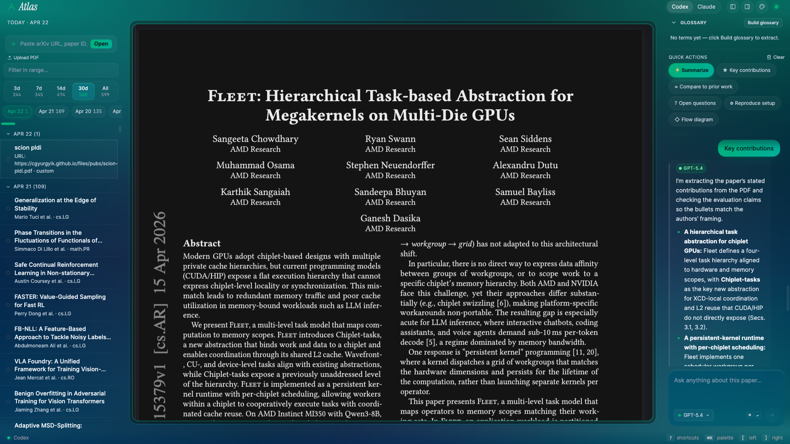

# Atlas

> A local-first daily reviewer for arXiv papers in compilers, PL, and MLIR.
> Uses *your* `codex` or `claude` CLI subscription — **no API keys, \$0 recurring cost**.

[](https://github.com/tavakkoliamirmohammad/atlas-reader/actions/workflows/ci.yml)


Atlas fetches today's arXiv papers in the categories you care about, gives each a deep 10-section summary on demand, lets you highlight + ask follow-ups, and remembers everything locally. All AI work is done by spawning your own `codex` / `claude` CLI, so nothing leaves your machine and nothing is billed to an API account.



> **v0.2 breaking change:** `atlas start`, `atlas stop`, `atlas restart`, and native `atlas up` are removed. Docker is now the only supported runtime. Use `atlas up` / `atlas down`. See [`docs/superpowers/specs/2026-04-22-docker-only-and-configurable-ports-design.md`](docs/superpowers/specs/2026-04-22-docker-only-and-configurable-ports-design.md) for the rationale.

## Quick start

Docker is the supported runtime. You don't need Node, pnpm, or Python on the host — just Docker and your AI CLI.

```bash
git clone https://github.com/tavakkoliamirmohammad/atlas-reader atlas && cd atlas
python3.12 -m venv .venv && source .venv/bin/activate
pip install -e .                           # installs the `atlas` CLI
codex login                                # or run `claude` once
atlas up                                   # http://localhost:8765
```

`atlas up` starts the host AI runner, builds + starts the backend/frontend container, waits for health, and opens your browser. Stop with `atlas down`.

> Docker's multi-stage build does `pnpm install && pnpm build` inside the `node:20-alpine` build stage — the compiled SPA is copied into the Python runtime image as static files. No Node toolchain needed on your machine.

## Custom ports

If `8765` (backend) or `8766` (runner) is already taken on your host, pick another:

```bash
atlas up --port 9000 --runner-port 9001
# or export ahead of time:
export ATLAS_PORT=9000
export ATLAS_RUNNER_PORT=9001
atlas up
```

Flags are persisted to `~/.atlas/runner.env` so subsequent `atlas down`, `atlas status`, `atlas logs`, and `atlas open` all pick up the same ports.

## Commands

| Command | What it does |
| --- | --- |
| `atlas up [--port N] [--runner-port N]` | Start host runner + backend container; wait for health; open browser. |
| `atlas down` | Stop the container and the host runner. |
| `atlas status` | `docker compose ps` + runner status + active ports. |
| `atlas logs` | Stream backend container logs (`docker compose logs -f atlas`). |
| `atlas runner-logs` | Tail `~/.atlas/atlas-runner.log`. |
| `atlas open` | Open `http://localhost:$ATLAS_PORT` in your browser. |
| `atlas doctor` | Print security posture + active ports. |
| `atlas start-runner` / `atlas stop-runner` | Manage the host runner in isolation (rare). |
| `atlas install-launchd` / `atlas uninstall-launchd` | Start Atlas at login (macOS). |

## Architecture

Two processes, always:

```
┌─────────────────────────────┐            ┌────────────────────────────┐
│  Backend (container or host) │ ──HTTP──▶ │  AI runner (host only)     │
│  FastAPI · :8765             │   NDJSON  │  Spawns codex / claude     │
│  Serves SPA + REST + SSE     │ ◀─stream─ │  Keychain + ~/.codex here  │
└─────────────────────────────┘            └────────────────────────────┘
               ▲                                        ▲
               └──────── shared ~/.atlas/ ──────────────┘
                  (SQLite, PDFs, runner.secret)
```

The runner cannot live in a container — `codex` / `claude` read your macOS Keychain and `~/.codex/` credentials. Put the backend anywhere; the runner stays on your machine. See `CLAUDE.md` for the fuller walk-through.

## Data

Everything under `~/.atlas/`:
- `atlas.db` — SQLite (papers, conversations, highlights, glossary).
- `pdfs/` — local PDFs for custom URL/upload imports. arXiv PDFs are streamed on demand.
- `runner.secret` — bearer token for the runner, mode 0600.

Override the location with `ATLAS_DATA_DIR=/path/to/dir`.

## Tests

```bash
pytest -q                                # backend (171 tests)
pnpm --dir frontend test:run             # frontend (37 tests)
```

## Contributing

See [CONTRIBUTING.md](CONTRIBUTING.md). Bug reports and design discussion welcome in issues; security reports via the Security tab (see [SECURITY.md](SECURITY.md)).

## License

**[PolyForm Noncommercial 1.0.0](LICENSE)** — personal, research, hobby, educational, charitable, and non-profit use only. **No commercial use.** Software is provided as-is, with no warranty and no obligation on the author to fix bugs or provide support. See [LICENSE](LICENSE) for the full terms.

If you want a commercial license, open an issue.
